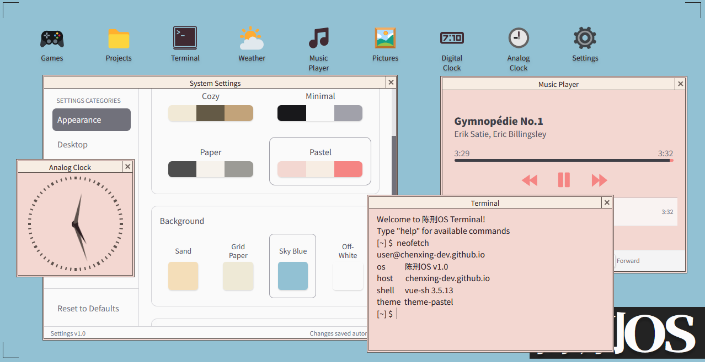

# 陈刑OS - A Cozy Minimalist OS-Styled Personal Website

[](https://opensource.org/licenses/MIT)

陈刑OS is a personal portfolio website designed to mimic an operating system interface. Built with Vue.js and TypeScript, it features draggable windows, a terminal emulator, and interactive apps that showcase my projects in a cozy desktop environment.



## ✨ Features

- 🖥️ **Desktop Interface**
  - 🪟 **Window Management System**: Vue-powered draggable windows with z-index management
  - 💾 **Persistent State** - Window positions saved between sessions
- 🎮 **Gaming Library** - Showcase of game projects and favorites
- 🐧 **Terminal Emulator** with common Linux commands
- 💻 **Code Projects** - GitHub projects with tech stack icons
- ⚙️ **Settings** - Customize the OS experience
  - Theme selection
  - Background textures
- 🕒 **Live Clock** - Current time and date display


## 🚀 Live Demo

Experience 陈刑OS directly in your browser:  
[https://chenxing-dev.github.io/](https://dev-chenxing.github.io/)

## 🛠️ Installation

To run locally:

1. Clone the repository:
   ```bash
   git clone https://github.com/chenxing-dev/chenxing-dev.github.io.git
   cd chenxing-dev.github.io
   ```

2. Install dependencies:
   ```bash
   npm install
   ```

3. Start the development server:
   ```bash
   npm run dev
   ```

4. Build for production:
   ```bash
   npm run build
   ```

## 📂 Project Structure

```
chenxing-dev.github.io/
├── public/                  # Static assets
│   ├── audio/               # Sound files
│   └── images/              # Background images
├── src/
│   ├── components/                   # Vue components
│   │   ├── desktop/                  # Desktop icons and wallpaper
│   │   └── windows/                  # Window components for each app
│   │       ├── MusicPlayer.vue
│   │       ├── TerminalWindow.vue
│   │       ├── Window.vue            # Window wrapper component
│   │       └── ...                   # Other app windows
│   ├── App.vue                       # Main app component
│   └── main.ts                       # Entry point
├── index.html                        # HTML template
├── package.json
├── README.md                         # Project documentation
├── tsconfig.json                     # TypeScript configuration
├── uno.config.ts                     # UnoCSS configuration
└── vite.config.ts                    # Vite configuration
```

## 🛠️ Built With

- [Vue 3](https://vuejs.org/) - Progressive JavaScript Framework
- [TypeScript](https://www.typescriptlang.org/) - Type-Safe JavaScript
- [Vite](https://vitejs.dev/) - Next Generation Frontend Tooling
- [UnoCSS](https://unocss.dev/) - Instant On-demand Atomic CSS Engine
- [GSAP](https://greensock.com/gsap/) - Professional JavaScript Animation
- [Vue Draggable Resizable](https://github.com/mauricius/vue-draggable-resizable) - Draggable and resizable components
- [VueUse](https://vueuse.org/) - Collection of Vue Composition Utilities
- [GitHub Pages](https://pages.github.com/) - Static Site Hosting

## 🪟 Window Apps

| App        | Description                                               |
| ---------- | --------------------------------------------------------- |
| 🎮 Gaming   | Showcases game development projects and favorite games    |
| 🐧 Terminal | Interactive terminal emulator with Linux-like commands    |
| 💻 Projects | GitHub project cards with tech stack information          |
| 👤 About    | Personal bio and background information                   |
| ✉️ Contact  | Contact form and social media links                       |
| 🕒 Clock    | Live time and date display                                |
| ⚙️ Settings | OS customization options                                  |

## 🤝 Contributing

Contributions are welcome! If you find any issues or have suggestions for improvements:

1. Fork the project
2. Create your feature branch (`git checkout -b feature/AmazingFeature`)
3. Commit your changes (`git commit -m 'Add some AmazingFeature'`)
4. Push to the branch (`git push origin feature/AmazingFeature`)
5. Open a Pull Request

## 📄 License

Distributed under the MIT License. See `LICENSE` for more information.

## 📬 Contact

陈刑 - 微博[@陈刑很刑](https://weibo.com/u/7874224893)
