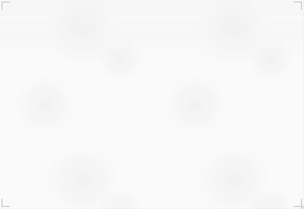
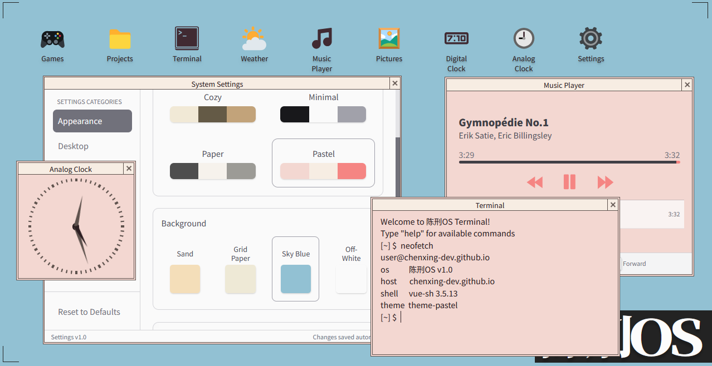

# 陈刑OS - A Cozy Minimalist OS-Styled Personal Website

[](https://opensource.org/licenses/MIT)

陈刑OS is a personal portfolio website designed to mimic an operating system interface. Built with Vue.js and TypeScript, it features draggable windows, a terminal emulator, and interactive apps that showcase my projects in a cozy desktop environment.




## ✨ Features

- 🖥️ **Desktop Interface**
  - 🪟 **Window Management System**: Vue-powered draggable windows with z-index management
  - 💾 **Persistent State** - Window positions saved between sessions
- 🐧 **Terminal Emulator** with common Linux commands
- 💻 **Code Projects** - GitHub projects with tech stack icons
- ⚙️ **Settings** - Customize the OS experience
  - Theme selection
  - Background textures
- 🕒 **Live Clock** - Current time and date display

## 🚀 Live Demo

Experience 陈刑OS directly in your browser:  
[https://chenxing-dev.github.io/](https://dev-chenxing.github.io/)

## 🛠️ Installation

To run locally:

1. Clone the repository:

   ```bash
   git clone https://github.com/chenxing-dev/chenxing-dev.github.io.git
   cd chenxing-dev.github.io
   ```

2. Install dependencies:

   ```bash
   npm install
   ```

3. Start the development server:

   ```bash
   npm run dev
   ```

4. Build for production:
   ```bash
   npm run build
   ```

## 📂 Project Structure

```
chenxing-dev.github.io/
├── public/                           # Static assets served by Vite
│   ├── audio/                        # Music files
│   ├── favicon.svg                   # Site favicon
│   └── fonts/                        # Custom fonts
├── src/
│   ├── components/                   # Desktop shell and app windows
│   │   ├── Desktop.vue               # Desktop orchestrator
│   │   ├── Window.vue                # Shared window frame
│   │   ├── WindowLayer.vue           # Window renderer and event bridge
│   │   ├── apps/                     # Individual desktop apps
│   │   │   ├── AboutMe.vue
│   │   │   ├── AnalogClock.vue
│   │   │   ├── Calculator.vue
│   │   │   ├── DigitalClock.vue
│   │   │   ├── MusicPlayer.vue
│   │   │   ├── ProjectsApp.vue
│   │   │   ├── SettingsApp.vue
│   │   │   ├── Terminal.vue
│   │   │   └── Weather.vue
│   │   └── desktop/                  # Desktop visuals and icons
│   │       ├── DesktopIcon.vue
│   │       └── Wallpaper.vue
│   ├── composables/                  # Shared state and window behavior
│   │   ├── useSettings.ts
│   │   ├── useWindowAnimations.ts
│   │   ├── useWindowController.ts
│   │   └── useWindowState.ts
│   ├── config/
│   │   └── apps-registry.ts          # App metadata and component registry
│   ├── icons/                        # SVG icon components
│   ├── lib/
│   │   ├── number.ts
│   │   └── vue-draggable-resizable.d.ts
│   ├── App.vue                       # Root app component
│   ├── main.ts                       # Entry point
│   ├── types.d.ts                    # Shared TypeScript types
│   └── vite-env.d.ts                 # Vite type declarations
├── index.html                        # HTML template
├── package.json
├── README.md                         # Project documentation
├── tsconfig.app.json                 # App TypeScript config
├── tsconfig.json                     # Base TypeScript config
├── tsconfig.node.json                # Node and tooling TypeScript config
├── uno.config.ts                     # UnoCSS configuration
└── vite.config.ts                    # Vite configuration
```

## 🏗️ Component Flow

The desktop UI is organized around a small set of shell components and composables. Shared window state lives in a central store, WindowLayer renders the window stack and relays events, and each app component stays focused on rendering its own interface.

Summary:

- `Desktop.vue` connects the wallpaper, desktop icons, window layer, and shared desktop state.
- `WindowLayer.vue` is a thin render-and-event-bridge layer. It renders `Window` for each open window and forwards focus/close events to the desktop state.
- `Window.vue` provides the shared window shell, including the frame, controls, and app mount point.
- `useWindowState.ts` is the source of truth for open windows, focus order, z-index changes, and persisted window positions.
- `useWindowController.ts` handles per-window behavior such as dragging, animation hooks, and app resolution from the registry.
- App components inside `components/apps/` render feature-specific UI and do not manage global window state directly.

## 🛠️ Built With

- [Vue 3](https://vuejs.org/) - Progressive JavaScript Framework
- [TypeScript](https://www.typescriptlang.org/) - Type-Safe JavaScript
- [Vite](https://vitejs.dev/) - Next Generation Frontend Tooling
- [UnoCSS](https://unocss.dev/) - Instant On-demand Atomic CSS Engine
- [GSAP](https://greensock.com/gsap/) - Professional JavaScript Animation
- [Vue Draggable Resizable](https://github.com/mauricius/vue-draggable-resizable) - Draggable and resizable components
- [VueUse](https://vueuse.org/) - Collection of Vue Composition Utilities
- [GitHub Pages](https://pages.github.com/) - Static Site Hosting

## 🪟 Window Apps

| App         | Description                                            |
| ----------- | ------------------------------------------------------ |
| 🐧 Terminal | Interactive terminal emulator with Linux-like commands |
| 💻 Projects | GitHub project cards with tech stack information       |
| 🕒 Clock    | Live time and date display                             |
| ⚙️ Settings | OS customization options                               |

## 🤝 Contributing

Contributions are welcome! If you find any issues or have suggestions for improvements:

1. Fork the project
2. Create your feature branch (`git checkout -b feature/AmazingFeature`)
3. Commit your changes (`git commit -m 'Add some AmazingFeature'`)
4. Push to the branch (`git push origin feature/AmazingFeature`)
5. Open a Pull Request

## 📄 License

Distributed under the MIT License. See `LICENSE` for more information.

## 📬 Contact

陈刑 - 微博[@陈刑很刑](https://weibo.com/u/7874224893)
